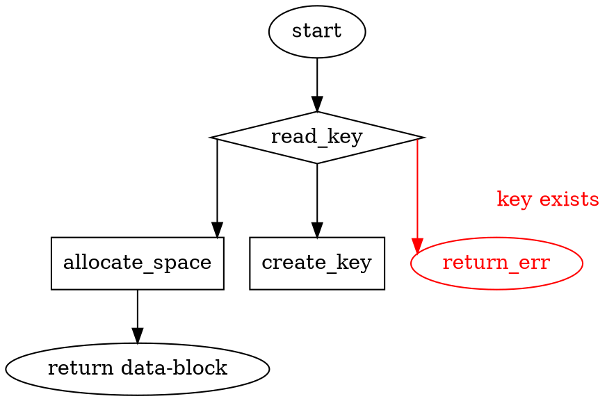

# REQ-purpose
The purpose of this project is to creat an _ultra fast_ single file database,
with the primary purpose being support of loggers that have _nested logging_.

A nested logger might look like this:

- 10:03:02 INFO {some data}
- 10:03:05 START CONTEXT
    - 10:03:06 DEBUG {some data}
    - 10:03:06 ERROR {some data}
    - ... etc
    - 10:10:22 Start context {
        ... etc
    }
}
- 10:03:06 START CONTEXT
    - 10:03:07 DEBUG {some data}
    ... etc
- 10:03:07 INFO {some data}
- ... etc

The above example shows several requirements:
- The _Write Head_ for the any of the loggers (root or context) is always
  pushing _larger_ values. Therefore a B+Tree with an always available _head_
  will have very good performance.
- The context loggers might be logging in parallel to any other logger.  They
  should not care how many other contexts are logging simultaniously, the whole
  process should be lockless.

## Basic API

The database is a key/value CRUD database, where:
- `Create`: can ONLY create, never update
- `Read`: can be done as long as there are no writers.
- `Update`: comes in two flavors:
  - overwrite: the data must fit in the original data's `capacity`
  - replace: the original data is deleted and a new key is inserted, all in one
    operation.
- `Delete`: deletes a key. The space is not reclaimed and the only way to
  reduce the size of the file is to not have ANY outstanding pointers.

# SPC-create
partof: REQ-purpose
###
The create process is roughly:

Some notes:
- The data-block can be returned *before* the key is set.
  This allows data to be written in parallel with other
  database operations.

# SPC-types
partof: REQ-purpose
###
These are the following primary types:
- Allocator: structure with a single method, `allocate`, which gives back (new)
  valid file regions to write to with their header filled in.
- TransactionHandler: is the only type that can swap the _primary / secondary_
  section of the Tree Nodes or set the _done_ flag for data nodes. When it does
  this it:
  - logs (to file) a StartTransaction, then the exact swaps it
    will perform, then an EndTransaction.
  - When all swaps have been completed it clears the log.
  - Only one transaction can happen at a time, although there may be more than
    one transaction handler.
  - When a transaction is complete, all associated `transaction-tag`s are
    removed from the cached-map.
- Tree + Node: A Tree is a root `Node` with its children `Node`s. The "active
  nodes" of the tree are kept in memory.
  - Find a place to insert a key (this may be cached). If the key exists, check
    that the `id` is equal to the key's current `id`. If so, accept the change
    and increment the `id`.
  - Any requested update gets a `tag` returned, which is just an atomically
    incrementing u64. This tag is kept in a ConcurrentHashMap until the operation
    is complete and all tags related to any operation are returned as part of
    the function.
    - The TransactionHandler is the only object that can remove tags from the map.
  - IN PARALLEL: Allocate space for the value from the Allocator, store it's tag
    and write the value of the data into the reserved space.
  - Find a place in which to insert the key
    - If a new child is needed, it must be allocated and put in the cache.
  - IN PARALLEL: return the tags of the key+value. The operation is complete
    _in the cache_ (but is not yet flushed to disk).
  - Pool up these requests (in memory) for a set amount of time.
  - Make a clone of current "active" and sync that to the _secondary_ keys on
    disk. In the cache this becomes the new "outdated"
  - Once sync is complete, send a request to the TransactionHandler to swap
    primary/secondary keys.
  - Note: there is the possibility that a key may point to data that is not
    yet "done". To avoid this, an alternative API exists where you can flush
    the data first and THEN insert the key using the data's offset.

# SPC-layout
GaryDB is a collection of `BTree`s, each of which is entirely independent
of either it's parents or children.

## In File
The BTree are built in the standard format, with each node containing N number
(probably 63) keys and (N+1) offsets to "leaf nodes".  Edits can be made *per
node* (note: multiple per tree!) simultaniously. The lock is stored in a
HashMap containing which nodes are locked by their Offset address.

```dot
digraph G {
    node [shape=box];

    table [label=<
<TABLE ALIGN="left" BORDER="0" CELLBORDER="1" CELLSPACING="0">
  <TR><TD PORT="addr"><i>(0x10)</i></TD></TR>
  <TR>
    <TD BGCOLOR="gray"><b>Header </b></TD>
    <TD><i>type=GenTree</i></TD>
    <TD><i>parent=0x00</i></TD>
    <TD><i>deleted=0</i></TD>
    <TD><i>done=0</i></TD>
  </TR>
  <TR>
    <TD></TD>
    <TD PORT="k_1a">key_1a</TD>
    <TD PORT="l_1b">leaf_1b</TD>
    <TD PORT="k_2a">key_2a</TD>
  </TR>
</TABLE>
>];

    leaf_1b [label=<
<TABLE ALIGN="left" BORDER="0" CELLBORDER="1" CELLSPACING="0">
  <TR><TD PORT="addr"><i>(0x20)</i></TD></TR>
  <TR>
    <TD PORT="head" BGCOLOR="gray"><b>Header </b></TD>
    <TD><i>type=GenTree</i></TD>
    <TD><i>parent=0x10</i></TD>
    <TD><i>deleted=0</i></TD>
    <TD><i>done=0</i></TD>
  </TR>
  <TR>
    <TD></TD>
    <TD>key_1b</TD>
    <TD>leaf...</TD>
    <TD>key...</TD>
  </TR>
</TABLE>
>];

    data_1a [label=<
<TABLE ALIGN="left" BORDER="0" CELLBORDER="1" CELLSPACING="0">
  <TR><TD PORT="addr"><i>(0x30)</i></TD></TR>
  <TR>
    <TD PORT="head" BGCOLOR="gray"><b>Header </b></TD>
    <TD><i>type=GenData</i></TD>
    <TD><i>parent=0x10</i></TD>
    <TD><i>deleted=0</i></TD>
    <TD><i>done=0</i></TD>
  </TR>
</TABLE>
>];

    table_2a [label=<
<TABLE ALIGN="left" BORDER="0" CELLBORDER="1" CELLSPACING="0">
  <TR><TD PORT="addr"><i>(0x40)</i></TD></TR>
  <TR>
    <TD PORT="head" BGCOLOR="gray"><b>Header </b></TD>
    <TD><i>type=GenTable</i></TD>
    <TD><i>parent=0x10</i></TD>
    <TD><i>deleted=0</i></TD>
    <TD><i>done=0</i></TD>
  </TR>
  <TR>
    <TD></TD>
    <TD>key_other</TD>
    <TD>leaf...</TD>
    <TD>key...</TD>
  </TR>
</TABLE>
>];

    // { rank = same {Type, Name, Artifact, Completed}}
    table:k_1a   -> data_1a:addr
    table:l_1b   -> leaf_1b:addr
    table:k_2a   -> table_2a:addr
}
```

Notice that the root table has two "key:value" pairs... but they point to
*different* things. `key_1a` points to `GenData` and `key_2a` points to
`GenTable`.

> leaf_1b is a standard B+Tree leaf, where the keys `1a < 1b < 2a`

