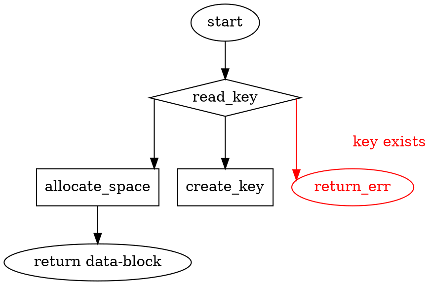

# REQ-purpose
The purpose of this project is to creat an _ultra fast_ single file database,
with the primary purpose being support of loggers that have _nested logging_.

A nested logger might look like this:

- 10:03:02 INFO {some data}
- 10:03:05 START CONTEXT
    - 10:03:06 DEBUG {some data}
    - 10:03:06 ERROR {some data}
    - ... etc
    - 10:10:22 Start context {
        ... etc
    }
}
- 10:03:06 START CONTEXT
    - 10:03:07 DEBUG {some data}
    ... etc
- 10:03:07 INFO {some data}
- ... etc

The above example shows several requirements:
- The _Write Head_ for the any of the loggers (root or context) is always
  pushing _larger_ values. Therefore a B+Tree with an always available _head_
  will have very good performance.
- The context loggers might be logging in parallel to any other logger.  They
  should not care how many other contexts are logging simultaniously, the whole
  process should be lockless.

## Basic API

The database is a key/value CRUD database, where:
- `Create`: can ONLY create, never update
- `Read`: can be done as long as there are no writers.
- `Update`: comes in two flavors:
  - overwrite: the data must fit in the original data's `capacity`
  - replace: the original data is deleted and a new key is inserted, all in one
    operation.
- `Delete`: deletes a key. The space is not reclaimed and the only way to
  reduce the size of the file is to not have ANY outstanding pointers.

# SPC-create
partof: REQ-purpose
###
The create process is roughly:

Some notes:
- The data-block can be returned *before* the key is set.
  This allows data to be written in parallel with other
  database operations.

# SPC-layout
GaryDB is a collection of `BTree`s, each of which is entirely independent
of either it's parents or children.

## In File
The BTree are built in the standard format, with each node containing N number
(probably 63) keys and (N+1) offsets to "leaf nodes".  Edits can be made *per
node* (note: multiple per tree!) simultaniously. The lock is stored in a
HashMap containing which nodes are locked by their Offset address.

```dot
digraph G {
    node [shape=box];

    table [label=<
<TABLE ALIGN="left" BORDER="0" CELLBORDER="1" CELLSPACING="0">
  <TR><TD PORT="addr"><i>(0x10)</i></TD></TR>
  <TR>
    <TD BGCOLOR="gray"><b>Header </b></TD>
    <TD><i>type=GenTree</i></TD>
    <TD><i>parent=0x00</i></TD>
    <TD><i>deleted=0</i></TD>
    <TD><i>done=0</i></TD>
  </TR>
  <TR>
    <TD></TD>
    <TD PORT="k_1a">key_1a</TD>
    <TD PORT="l_1b">leaf_1b</TD>
    <TD PORT="k_2a">key_2a</TD>
  </TR>
</TABLE>
>];

    leaf_1b [label=<
<TABLE ALIGN="left" BORDER="0" CELLBORDER="1" CELLSPACING="0">
  <TR><TD PORT="addr"><i>(0x20)</i></TD></TR>
  <TR>
    <TD PORT="head" BGCOLOR="gray"><b>Header </b></TD>
    <TD><i>type=GenTree</i></TD>
    <TD><i>parent=0x10</i></TD>
    <TD><i>deleted=0</i></TD>
    <TD><i>done=0</i></TD>
  </TR>
  <TR>
    <TD></TD>
    <TD>key_1b</TD>
    <TD>leaf...</TD>
    <TD>key...</TD>
  </TR>
</TABLE>
>];

    data_1a [label=<
<TABLE ALIGN="left" BORDER="0" CELLBORDER="1" CELLSPACING="0">
  <TR><TD PORT="addr"><i>(0x30)</i></TD></TR>
  <TR>
    <TD PORT="head" BGCOLOR="gray"><b>Header </b></TD>
    <TD><i>type=GenData</i></TD>
    <TD><i>parent=0x10</i></TD>
    <TD><i>deleted=0</i></TD>
    <TD><i>done=0</i></TD>
  </TR>
</TABLE>
>];

    table_2a [label=<
<TABLE ALIGN="left" BORDER="0" CELLBORDER="1" CELLSPACING="0">
  <TR><TD PORT="addr"><i>(0x40)</i></TD></TR>
  <TR>
    <TD PORT="head" BGCOLOR="gray"><b>Header </b></TD>
    <TD><i>type=GenTable</i></TD>
    <TD><i>parent=0x10</i></TD>
    <TD><i>deleted=0</i></TD>
    <TD><i>done=0</i></TD>
  </TR>
  <TR>
    <TD></TD>
    <TD>key_other</TD>
    <TD>leaf...</TD>
    <TD>key...</TD>
  </TR>
</TABLE>
>];

    // { rank = same {Type, Name, Artifact, Completed}}
    table:k_1a   -> data_1a:addr
    table:l_1b   -> leaf_1b:addr
    table:k_2a   -> table_2a:addr
}
```

Notice that the root table has two "key:value" pairs... but they point to
*different* things. `key_1a` points to `GenData` and `key_2a` points to
`GenTable`.

> leaf_1b is a standard B+Tree leaf, where the keys `1a < 1b < 2a`

